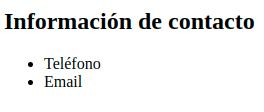
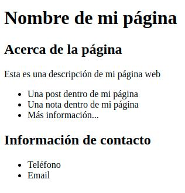

# Tarea

__IMPORTANTE__: Los ejercicios de este curso se basan principalmente en que usted intente replicar lo que nosotros le damos como ejemplo en una imagen. El resultado final debe acercarse a lo deseado en la imagen, pero usted puede agregarle su impronta o creatividad agregando o modificando elementos.

## Ejercicio 1
En la tarea de hoy, vamos a buscar internalizar conceptos como el anidado de etiquetas en HTML y de paso irnos familiarizando con algunas de estas.
  
Para ello vamos a tratar de obtener el siguiente resultado:

  
Para lograr lo antes mostrado generaremos un archivo HTML y colocaremos las etiquetas básicas de la estructura del archivo (HTML, body, etc)

Posteriormente utilizando las siguientes etiquetas para replicar la imagen:

- ```<h1></h1>```
-  ```<h2></h2>```
-   ```<p></p>```
-  ```<h2></h2>```
-   ```<p></p>```

## Ejercicio 2
Deberá utilizar las etiquetas de "lista" (como se vio en los ejemplos de estructura) para intentar obtener el siguiente resultado:



Utilice las siguientes etiquetas para replicar la imagen (además de las etiquetas básicas de estructura del archivo --> HTML, body, etc):

-  ```<h2></h2>```
- ```<ul>```
- ```<li> ... </li>```
- ```<li> ... </li>```
- ```</ul>```

## Ejercicio 3
Deberá tomar los conceptos de los ejercicios 1 y ejercicios 2 para intentar obtener el siguiente resultado



## Ejercicio 4
Deberá tomar el ejemplo anterior y agregar una imagen dentro de una etiqueta "div" después de la lista de descripción de elementos de la página. Utilizar la imagen "celular" que se encuentra dentro de la carpeta "images". Intentar obtener el siguiente resultado

