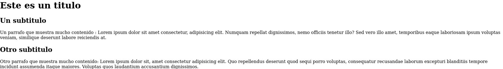

<h1>Tarea</h1>

<p>
  En la tarea de hoy, vamos a buscar internalizar conceptos como el anidado de etiquetas en HTML y de paso irnos familiarizando con algunas de estas.<br>
  Para ello vamos a tratar de obtener el siguiente resultado: 
  </p>
  
  
  
  <p>Para lograr lo antes mostrado generaremos un archivo HTML utilizando el atajo de teclado que nos provee EMMET al presionar signo de exclamasion (!), el cual
  nos desplegara una ventana de autocompletado para generar el codigo base de nuestro HTML (recordemos que para que esto funcione, lo debemos hacer dentro de un archivo)
  HTML.<br>
  Posteriormente utilizando las siguientes etiquetas buscaremos replicar la imagen: </p>
  
  - ```<h1></h1>```
  - ```<div></div>```
  -  ```<h2></h2>```
  -   ```<p></p>```
